# DocuSign SFDC Recipe: Embedded Sending and Signing with Lightning

This repo includes all files needed to demonstrate how Salesforce Partner Community members can sign documents from within the community.

The recipe supports many use cases including this example:

* A company ("World Wide Corp") uses Salesforce Community Cloud to host their partner community.
* When the company wants a partner to sign an agreement, they can create the signing request from within Salesforce.
* The request includes the name of the signer.
* When the signer next logs into the partner community, she sees the signing request in her chatter feed.
* She can click on the signing request, and then quickly sign the agreement from within the Salesforce community.

The recipe can also be used to create signing requests for orders, for HR paperwork, and more.

## Installation

### Step 1. Set up the Salesforce Community

[Create and configure the partner community on Salesforce.](https://github.com/docusign/sfdc-recipe-auto-provisioning/tree/master/docs/create_sfdc_community.md) This step includes:

* Creating a Salesforce Developer Environment
* Installing DocuSign eSignature for Salesforce
* Configuring a Salesforce Partner Community

### Step 2. Installing the recipe's content

The recipe can be installed either directly from this repo or from Salesforce as an unmanaged package.

#### Install from the unmanaged package

The unmanaged package enables you to install the recipe, and then use/modify the source files as you wish.

Installation steps:

* Login to SFDC with your Developer Environment (DE) credentials
* [Start the package installation](https://login.salesforce.com/packaging/installPackage.apexp?p0=04t0Y000000YOkm) 
* Click **Install for All Users**
  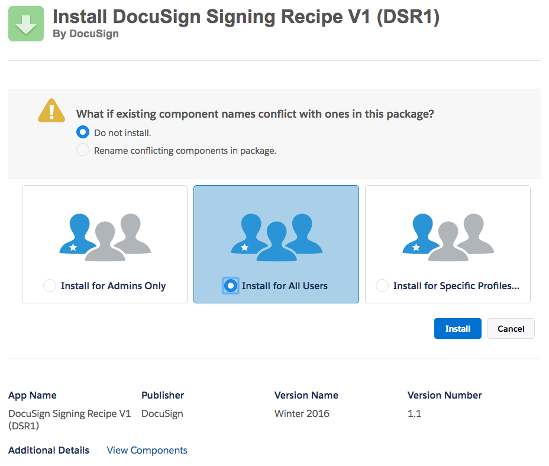

#### Installing from this repo

We use a popular open source [installation app](https://github.com/afawcett/githubsfdeploy) for this process. Unfortunately, it seems to have a [problem](https://github.com/afawcett/githubsfdeploy/issues/25) when installing
to a Salesforce instance that requires TLS 1.1. If you encounter this problem, you can try the workaround suggested by a developer: 

> Deactivate the TLS 1.1 update under "Critical Updates." Then revoke all the existing authentications, log out and clear cookies. Then it works! For some DEs it takes time (up to 12h) to get OAuth operations affected after TLS 1.1 is disabled.

If you install from this repo, you will also need to create the Named Credentials. If you use the unmanaged package, the Named Credentials are created, but need to be edited. This process is explained below.

Installing from this repo: 

* Click the button:  
* The next screen will show the repo information. Click **Login to Salesforce** (Upper-right corner)
  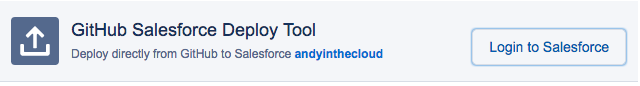
* Approve access to your Salesforce instance from the deploy tool: Click **Allow**
  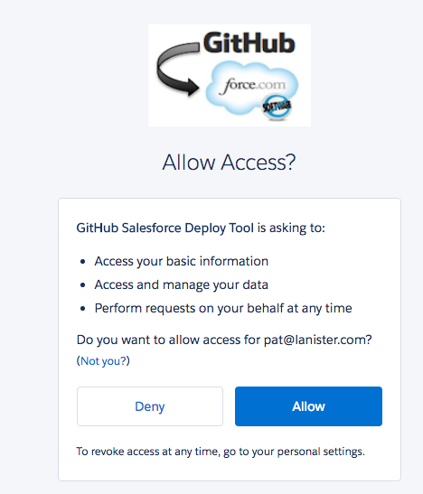
 

### Step 3. Configuration part I

The package includes the recipe's SFDC objects, code, permission sets and other content.

#### Update the Named Credentials

**Note:** If you installed from this repo, then you will need to create the two named credentials. 
Use the screenshots to see how the credentials should be set up.

* Click Setup. Type "named" in the quick find. Select **Named Credentials**
* You now see the **Named Credentials** screen
* Click **Edit** for the **DS_Demo_Integration_User** named credential
* You are now in the screen "Named Credential Edit: DS Demo Integration User"
* In the **Administration Username** and Password fields, enter DocuSign credentials for either an account admin, or a DocuSign user with the permission *Allow view and manage envelope rights through API*. This user name is used to manage the embedded signing process.
* In the **Callout Options** section of the page, change the checkboxes: **Only** the **Allow Merge Fields in HTTP Header** option should be checked. See the screenshot:
  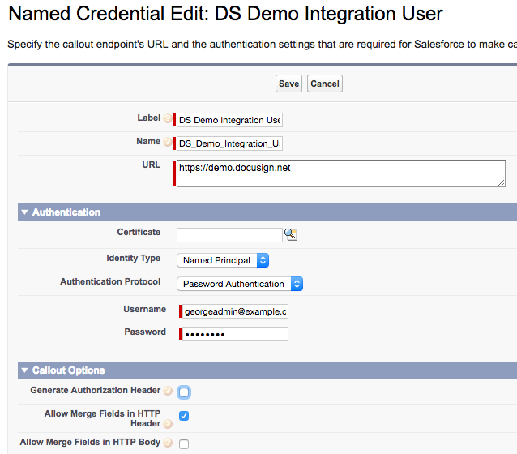
* Click **Save**

* After saving your work, you are back at the list of the Named Credentials.

* Click **Edit** for the credential **DS Demo User**. This credential is used by the people who *send* signing requests ("senders"). Each sender will enter her own credentials in a later step. 
* For this credential, **do not** enter an Administration Username or password
* In the **Callout Options** section of the page, change the checkboxes: **Only** the **Allow Merge Fields in HTTP Header** option should be checked. See the screenshot:
  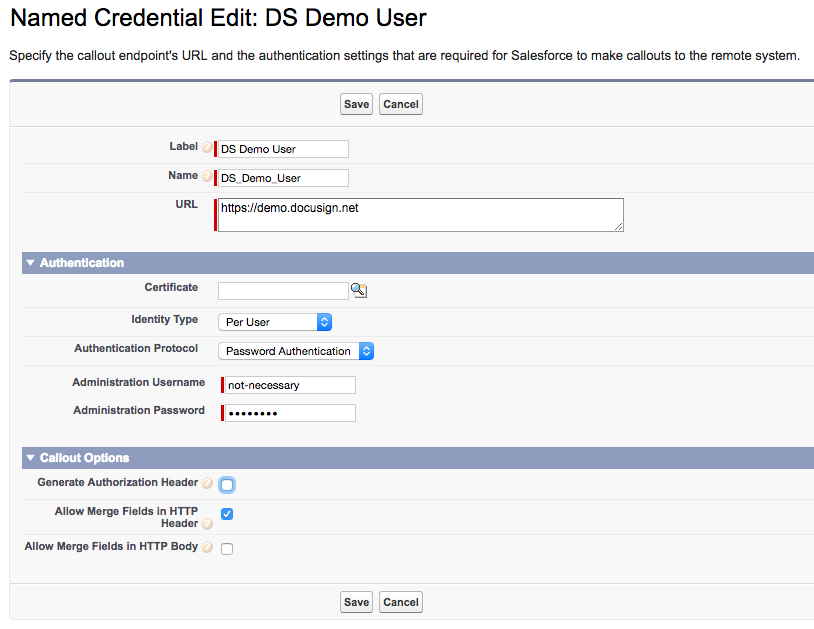
* Click **Save**

#### Assign Permission Sets to the users

* Click Setup. Enter "users" in the quick find and select **Manage Users / Users**
* For each of the users who will be sending signing requests or signing them:
* Open their user record by clicking on their name.
* Goto the **Permission Set Assignments** section. 
  Note: Use the right Permission set section!
  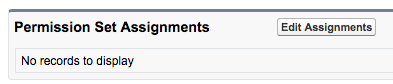
* Click **Edit Assigments**
* For senders: add **DocuSign Signing Recipe Sender** permissin. (Sender permission includes Signer permission)
* For signers: add **DocuSign Signing Recipe Signer** permission.
  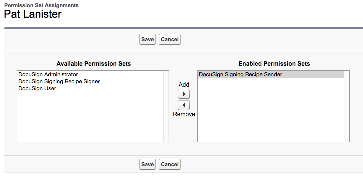

#### Each Sender enters their own DocuSign credentials
Each sender needs to enter their own DocuSign user name and password. 

* Click Setup. Type "users" in the quick find box. Select **Manage Users / Users**
* Open a sender's record by clicking on their name
* Go to section **Authentication Settings for External Systems**
* Click **New**
* The screen "Authentication Settings for External Systems" is shown.
* Update the form:
  * Named Credential: DS Demo User (existing value)
  * User: Choose the user (admins can set the info for any user, regular users 
    only update their own information)
  * Enter the person's individual DocuSign account username and password
    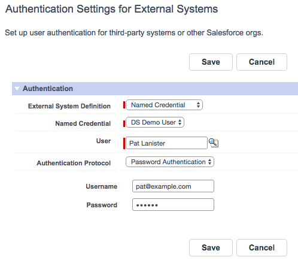
* Click **Save**

#### Add account ID and Integration Key
* Click Settings. Enter "custom meta" in the quick find field. Choose **Custom Metadata Types**
* Click **Manage Records** for the **DocuSign Signing Recipe Integration** item
* Click **Edit** on the **Default** record
* Fill in the your DocuSign account ID and Integration Key
  Note that you must use the long form (guid) of your DocuSign Account ID, which is 
  available from the API section of the admin tool.
* Click *Save*

### Create a new Signing Request!
* Switch to Lightning Experience to Send: use the *your name* menu > Switch to Lightning Experience
  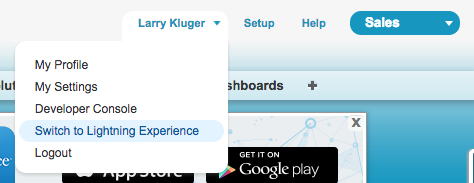
* Click the App Launcher icon (the "checkerboard" icon)
  
* Click the DocuSign Signing Recipe icon
  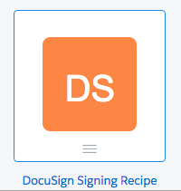
* Click **Signing Requests** to open the records list
* Click **New**
* The **Create Signing Request** modal opens
* Fill it in by entering a **Subject** and picking a **Signer name** 
* The **Description** field is optional
* Click **Save**
  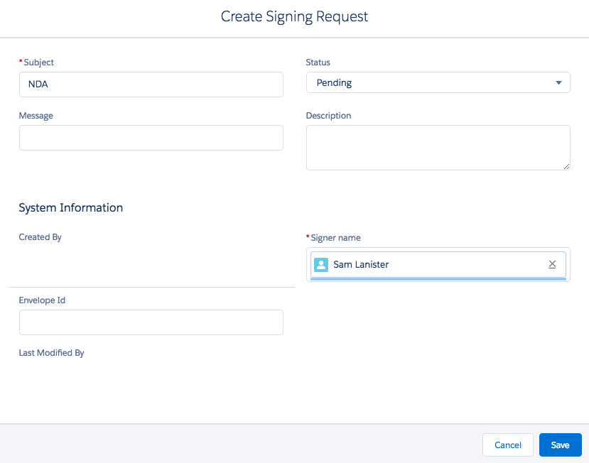
* The envelope is created on DocuSign. When the process completes, the 
  **Upload documents and send** button will be enabled. **Click** the button.
  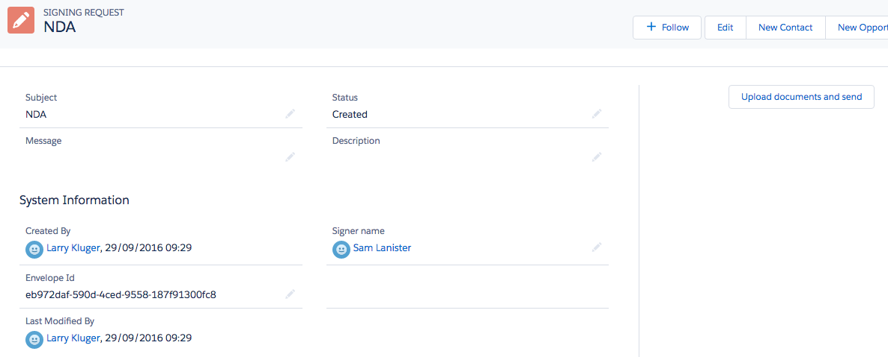
* You are redirected to DocuSign to add one or more documents to the envelope and to tag the documents. Within DocuSign, click **Send** when you've completed the envelope.
* You will be returned to the Salesforce system, to the Signing Request record. You can see that the record's status is now **Sent**
  

### Step 4. Configuration part II - Signer Access

#### Note your community's url
* In the main section of SFDC:
* Settings, then enter "communities" in the Quick search box. Choose **All Communities**
* Copy the link address shown for your community to a scratch area. You will need it for a later step.
* Be sure to copy the address that is shown (use **copy**). Do not copy the link's target value, which includes Javascript.

#### Editing your community
Open the **Community Builder**. There are two ways to open the Community Builder:

* If you are in the communities system, use the drop-down menu near your name.
  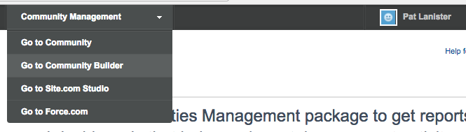
      
* If you are the main part of SFDC, from Setup, enter "all" in the Quick Find box, then select **All Communities**. Then click **Builder** next to your community's name

#### Navigating within the Community Builder
The community builder is an interactive tool with four main modes, selected using the icons on the left side of the screen. 

From the top to the bottom icons, the four modes are:

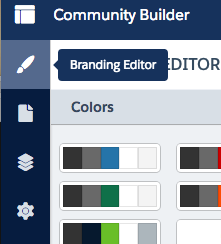 Branding Editor

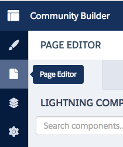 Page Editor

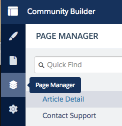 Page Manager

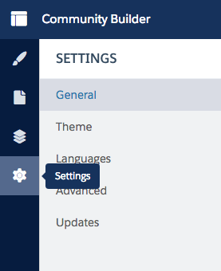 Settings

In the following steps, you will be switching between the different modes of the Community Builder.

#### Add Signing Request to the navigation bar
* Click on the Page Editor icon (second on left) 
* Click on the nav bar (Topics) within the page itself, so you can edit it
* Click **Edit Navigation Menu** on right side
* Click **Add Menu Item**
  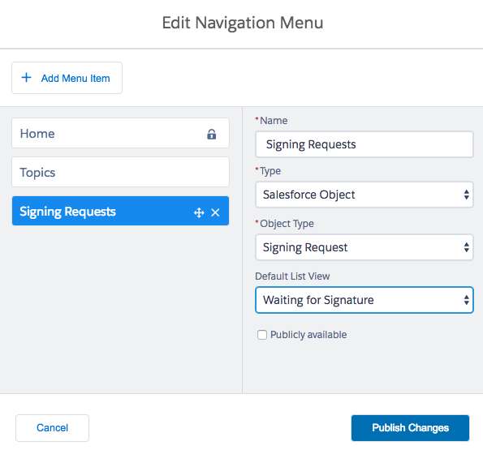
* Fill in the form for the new item:
  * Name: Signing Requests
  * Type: Salesforce Object
  * Object Type: Signing Request
  * Default List View: Waiting for Signature
  * Publicly available: do NOT check.  
  * Click **Publish Changes**

#### Create the object pages for Signing Request

Goto Page Manager (3rd icon)

* Click the + Icon and choose **Create Object Pages**
  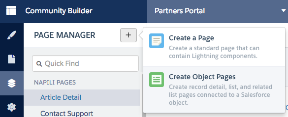
* You'll see the **New Object Pages** modal window
* For Salesforce Objects, choose **Signing Request**  (not DocuSign Signing)
* Click **Create**
* You now see the *Signing Request* page
* Click on the **Signing Request Detail** link
  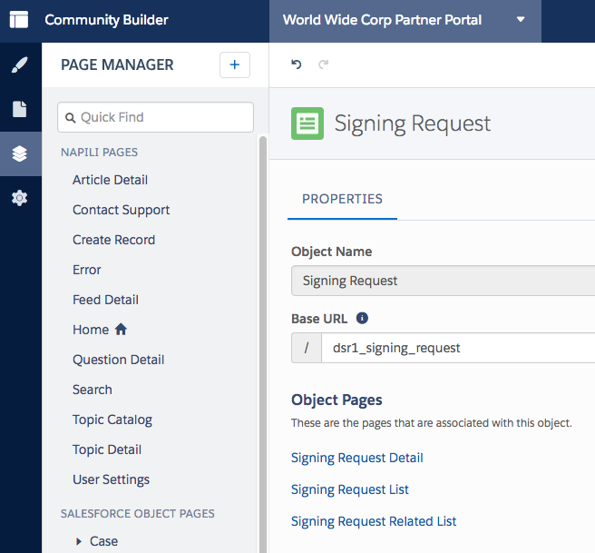
* Your are now seeing the Signing Request Detail page. 
* Click **Edit** (top right corner)
* You're now seeing the page editor for the page.
* Click **Change Layout** on the right side
* Choose 2 columns with 2:1 ratio
  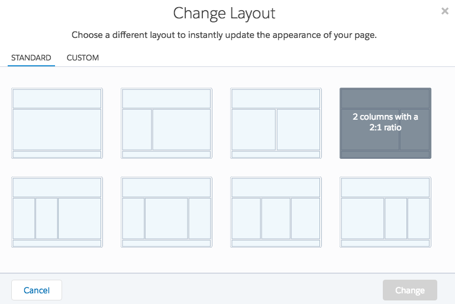
* Click **Change**
* The page editor will be refeshed. You will need a wide browser window for the next step.

#### Add the Signing button component
* Your page editor is still open
* You will need a wide browser window for this step.
* On the left, you see a list of components.
* Note the custom components section and the **Signing Request Sign Button** at the bottom.
* Note the **Add components to this region (Sidebar)** section of the editor's main pane
  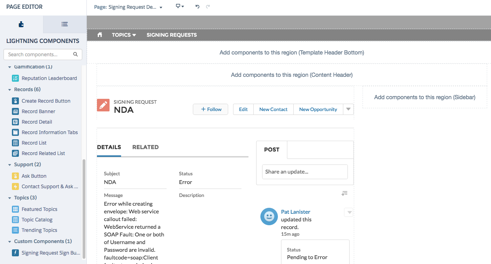
* Drag the compnent to the sidebar region of the page
* The **Property Editor** is the right column of the editor
* In the Property Editor, set the **Community URL** field to the url for the community that you saved earlier.
  Note: Copy the text from the All Communities screen, not the "link address"
   
#### Removing the status feed
By default, the Signing Request object detail screen includes a feed display about the record. The feed can be useful in development but may not be needed in production.

To remove it:

* Select the component for the detail record main section in the page editor
* In the component's properties change **Tab 3 Type** from **Feed** to **None**

#### Publish your changes
Click **Publish** (upper right corner)

### Step 5. Change feed default to all updates
By changing the feed default, community members will see their signing requests in their default chatter feed.

* Open Community Builder
* Open the Page Editor. You're editing the home page
  
#### Add the new feed component
Drag the **Feed** component to the page
If you receive an error such as the following, just perform the next step.
  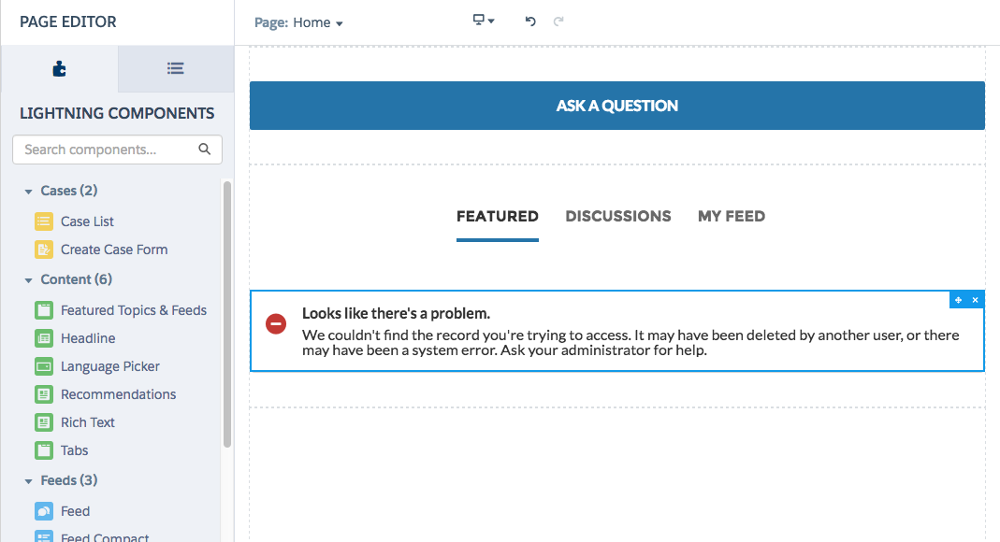
* In the Property Editor for "Feed":
* Change Feed type to "My Feed"
* Click **Publish**

#### Remove the default feed component
* Click on the **MY FEED** tab item within the main section of the page editor
  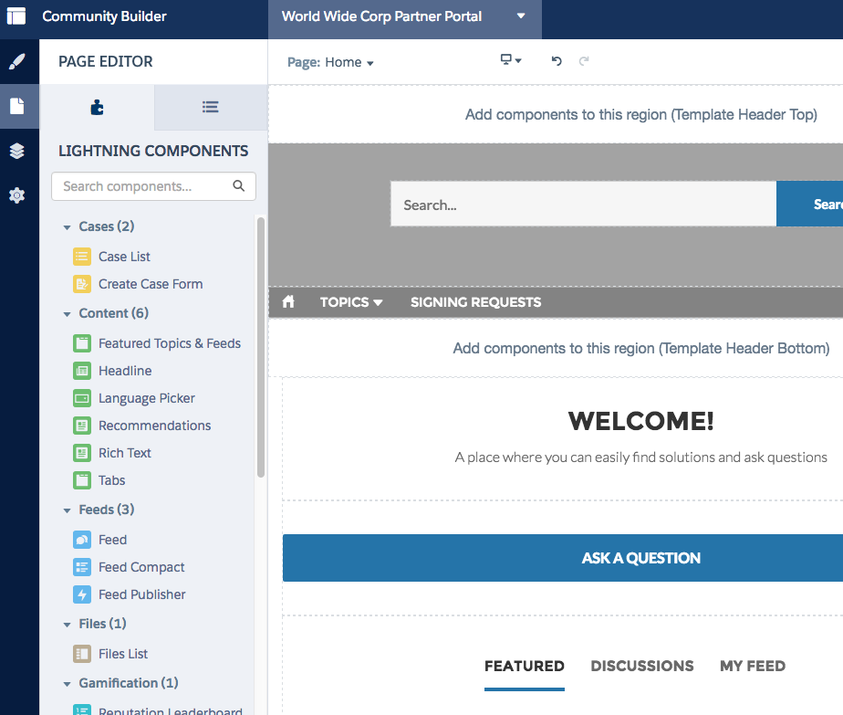
* The property editor will change to show "Featured Topics & Feeds" as the selected component. This is the default feed component for the community template.
* Delete the component by clcking on the x
  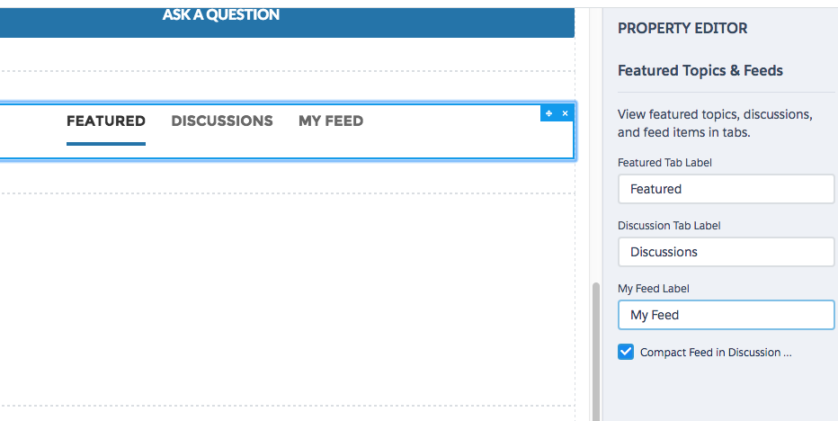
* Click **Publish**

## A test: signing an envelope
* As the person that you sent the signing request to, log in to the community.
* You can login directly, or open the person's contact record and choose **Manage External User > Login to Community As User**
* In the community, click **Signing Requests** in the navigation bar
* You will see the list of signing requests.
* Click on the **Subject** of a signing request to open it.
  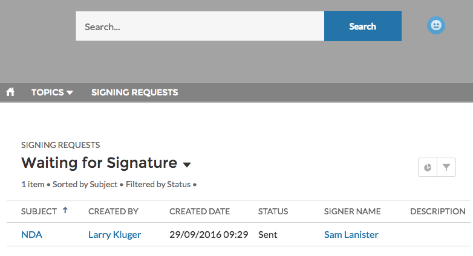
* Click the **Sign with DocuSign** button. Depending on your screen width, the button may be on the right or bottom of the screen.
* You will be redirected to DocuSign for the signing ceremony.
* After you complete the signing ceremony, you'll be redirected back to Salesforce. 

## Pull requests
* We welcome pull requests to improve this recipe.